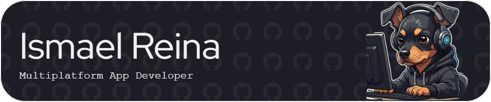

## Hey everyone!  👋 Welcome to my digital workshop.

I'm Ismael Reina, a junior software developer from Spain, passionate about learning, building, and leveling up.

---

### 💼 What I'm currently doing

- Working on Android and web development projects at a software company  
- Building side projects to strengthen my skills and explore new technologies  
- Focusing on improving my Android and web dev skills.
- My goal is to deepen my knowledge, gain experience, and eventually specialize in a specific area

---

### 📂 GitHub structure

This GitHub profile is still in its early stages 🏗️ I'm gradually organizing it to include:

- 💡 `projects/` → side projects and ideas
- 📚 `notes/` → study material and exercises
- 🔧 `tools/` → favorite dev tools and user guides

---

### ⚙️ My tech stack

**Languages**  
Java (advanced), Python (basic), JavaScript (basic)

**Mobile Development**  
Android (Java)

**Web Development**  
HTML5, CSS3, Drupal, WordPress

**Databases**  
MySQL, PL/SQL

**Tools & Environments**  
Git, GitHub, Docker

**Testing & QA**  
JUnit

**Game Development**  
Unity

**Other**  
UML, XML

---

### 📫 Contact

